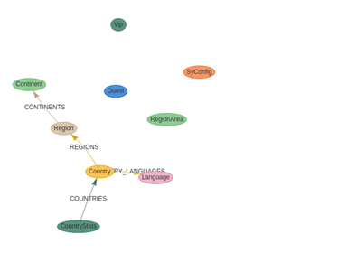
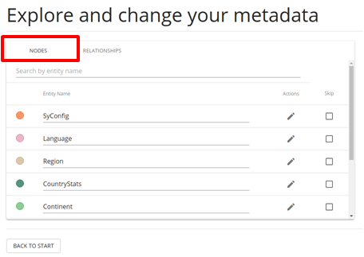
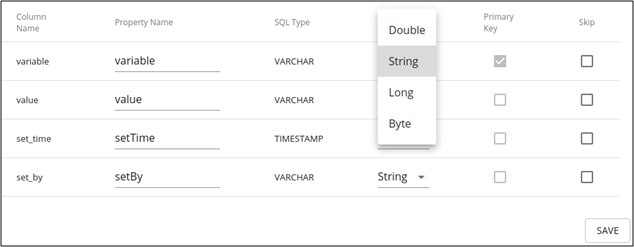

# 요구사항 명세서

| **Category** |   **RQ-ID**   |   **요구사항명**    |                      **요구사항 내용**                       | **참고 사항**            |  **날짜**  | 작성자  |
| :----------: | :-----------: | :-----------------: | :----------------------------------------------------------: | ------------------------ | :--------: | :-----: |
|     연결     | Connection-01 |      연결 설정      |                   연결 설정 기능 제공한다.                   | for Source, Target       | 2021-09-15 | win777c |
|| Connection-02 |     연결 테스트     |    연결 가능한 지 확인을 위한 연결 테스트 기능 제공한다.     | for Source, Target       | 2021-09-15 | win777c |
|변환| Transform-01  | 메타데이터 가져오기 |              GDBMS Meta 정보 가져오는 기능 제공              | Graph to Relational      | 2021-09-15 | win777c |
|| Transform-02  |     스키마 생성     |  GDBMS Meta 정보를 이용해 RDBMS 모델로 변환(매핑) 기능 제공  | Graph to Relational      | 2021-09-15 | win777c |
|              | Transform-03  | 메타데이터 가져오기 |             RDBMS 스키마 정보 가져오는 기능 제공             | Relational to Graph      | 2021-09-15 | win777c |
|              | Transform-04  |      모델 변환      |    RDBMS 스키마 정보를 그래프 모델로 변환(매핑) 기능 제공    | Relational to Graph      | 2021-09-15 | win777c |
|              | Transform-05  |       시각화        |          매핑된 모델을 그래프로 시각화를 제공한다.           | Read only  자료첨부 | 2021-09-15 | win777c |
|              | Transform-06  |  Vertex 속성 설정   |       시각화 된 그래프에서 Vertex 속성 설정할 수 있다.       | 자료첨부                 | 2021-09-15 | win777c |
|              | Transform-07  |   Edge 속성 설정    |      시각화 된 그래프에서 Edge 속성 설정을 할 수 있다.       | 자료첨부                 | 2021-09-15 | win777c |
|     이관     | Migration-01  |     스키마 생성     |         변환된 모델을 바탕으로 Schema 생성 기능 제공         | Graph to Relational      | 2021-09-15 | win777c |
|              | Migration-02  |     Import Data     |          마이그레이션 대상 Data를 Import 기능 제공           |                          | 2021-09-15 | win777c |
|              | Migration-03  |   이관 옵션 제공    |   이관될 데이터양에 따라 사용하는 쓰레드 수 조절 기능 제공   |                          | 2021-09-15 | win777c |
|              | Migration-04  |   Export Metadata   | CLI 로 마이그레이션 수행할 수 있도록 Metadata 파일을 export 하는 기능 제공 (GUI) |                          | 2021-09-15 | win777c |
|              | Migration-05  |      CLI 지원       |             GUI 도구와 호환 가능한 CLI 도구 제공             | CLI로 수행               | 2021-09-15 | win777c |
|              | Migration-06  |      증분 이관      | CUBRID에서 특정 시점 이후 변경된 데이터만 증분 이관하는 기능을 제공하며 CLI로 수행 가능하다. | Relational to Graph      | 2021-09-15 | win777c |
|     결과     |   Result-01   |   이관 결과 표시    |      이관 완료된 결과를 Summary하여 보여주는 기능 제공       |                          | 2021-09-15 | win777c |

# 참조 자료

### Transform-05

- Read only 로 시각화를 제공한다.

### Transform-06

- Neo4j ETL Tool 참조

### Transform-07

- Neo4j ETL Tool 참조
